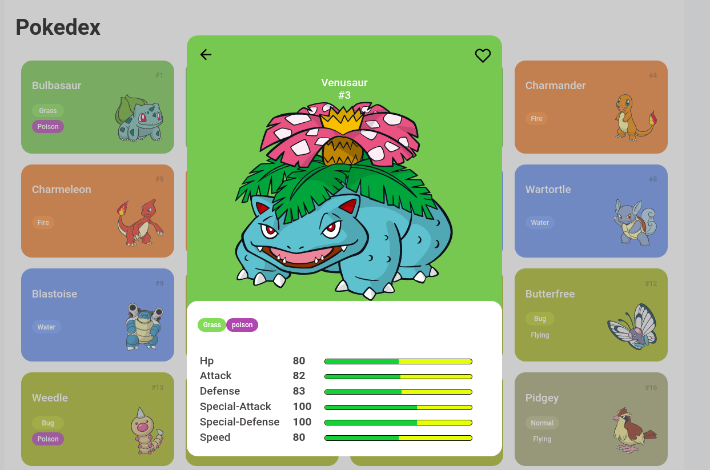

<h1 align="center" > Trilha JS Developer - Pokedex </h1>

<h3 align="center">
Desafio de Javascritp - Dio.me 
</h3>

  

## 🔖 Atividades desenvolvidas no desafio:

- Implementação de um Modal para expansão do layout original
- Expansão de novos detalhes referente ao projeto inicial (Pokedex)

##  🚀 Esse projeto foi desenvolvido com as seguintes tecnologias:

- HTML e CSS
- JavaScript
- Git e Github

Feito por Eris Pinheiro
